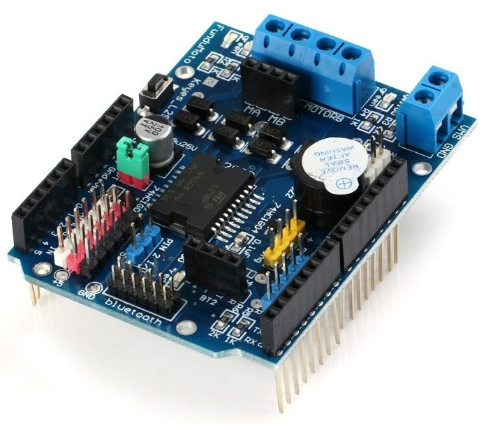
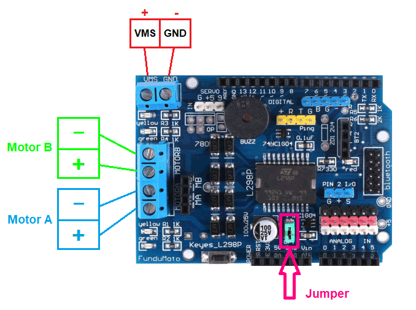
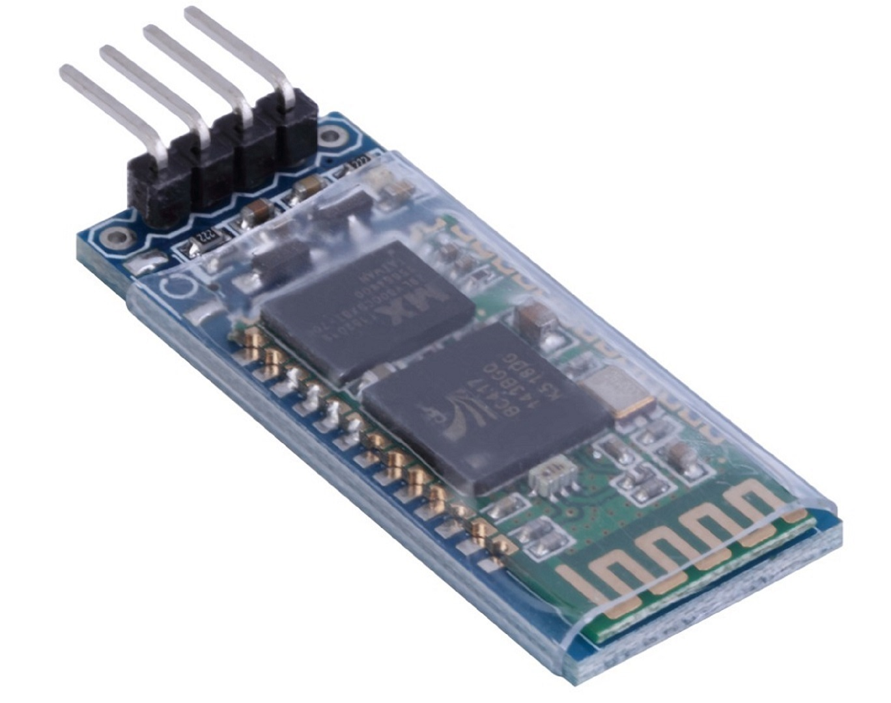
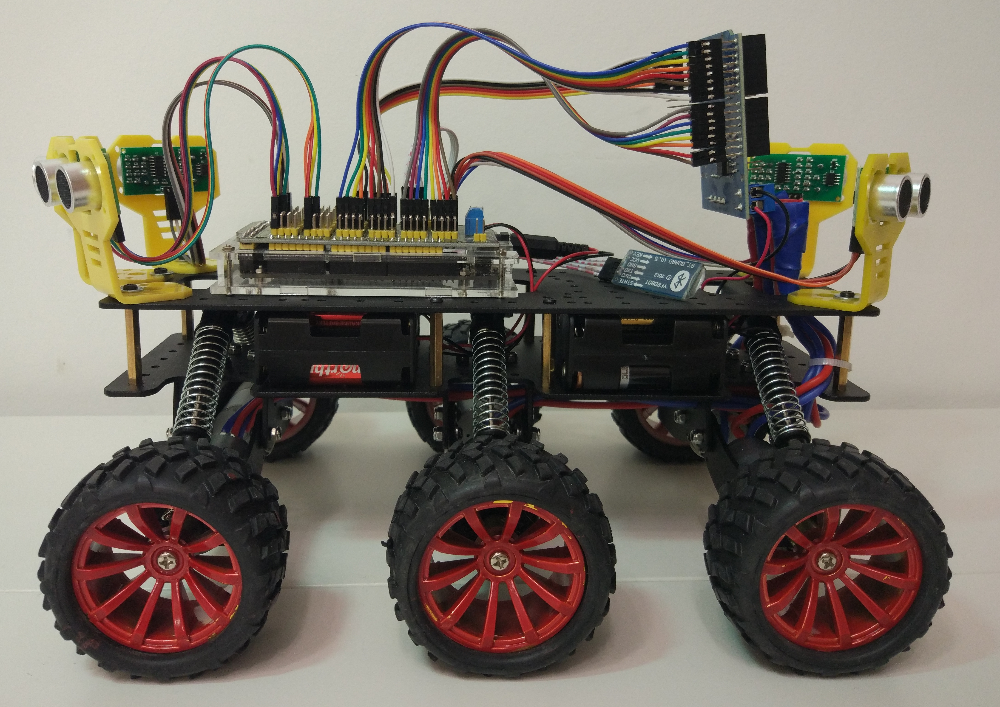

# Intelligent Mobile Robot
Movements Control of Mobile Robot.
 <b>Hardware</b> - Arduino Mega, Motor Shield L298P, 6 DC Motors, 6 Ultrasonic Sensors, Bluetooth Module, Batteries.
 <b>Software</b> - C# via Visual Studio, Arduino IDE, Android SDK.

### Reference to:
[1] Valentyn N Sichkar. Intelligent Movements Control of Mobile Robot // GitHub platform [Electronic resource]. URL: https://github.com/sichkar-valentyn/Intelligent_Mobile_Robot (date of access: XX.XX.XXXX)

## Description
### Introduction
Explaining the main goals of the Project.
 https://www.youtube.com/watch?v=srEd8KEh2uo
 

### Connecting DC Motors
Connecting and checking the High Pass Six Wheel Base - HPSWB - for simple commands to move.
 https://www.youtube.com/watch?v=Ux8xrQHnlzI
 

### More information about equipment
General view of the Motor Shield L298P is shown below on the figure.

 The view from the top of Motor Shield L298P and showing the main connectors that are needed for the Project.
 

 General view of the DC Motor.
 

 Connection DC Motors to the Shield.
 

 General view of the Bluetooth Module HC-06.
 

 Connection Bluetooth Module HC-06 to the Shield or Arduino.
 

 More about equipment.
 https://www.youtube.com/watch?v=6KQcZUehVFo
 

### Adding the Ultrasonic sensors
Checking the environment around with Ultrasonic Sensors.
 HPSWB with Ultrasonic Sensors - view from the front

 HPSWB with Ultrasonic Sensors - view from the back

 HPSWB with Ultrasonic Sensors - view from one side

 General view of the Ultrasonic Sensor US-015.
 

 Connection Ultrasonic Sensor US-015 to the Arduino.
 

### Checking the abilities to overcome obstacles
Implementing High Pass Six Wheel Base.

### Creating the Mobile Application Arduino-Android
Application to control the SWB via phone.

### Checking the abilities to stop before the possible collisions with obstacles
With the help of Ultrasonic sensors and seeing the obstacles to avoid the collisions.

### Adding the camera
Working with computer vision.

 Project is under construction
 _on its way ..._

## MIT License
## Copyright (c) 2017 Valentyn N Sichkar
## github.com/sichkar-valentyn
### Reference to:
[1] Valentyn N Sichkar. Intelligent Movements Control of Mobile Robot // GitHub platform [Electronic resource]. URL: https://github.com/sichkar-valentyn/Intelligent_Mobile_Robot (date of access: XX.XX.XXXX)
