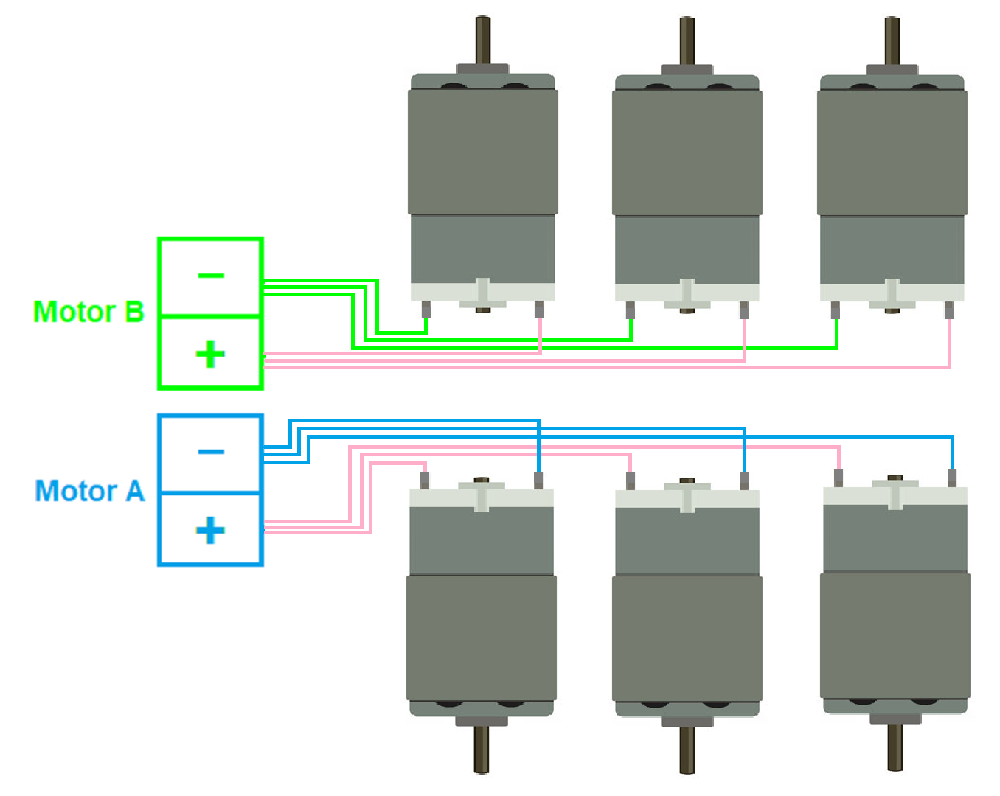
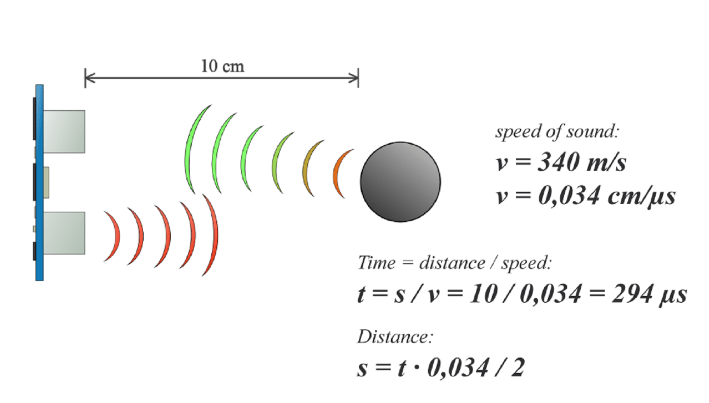
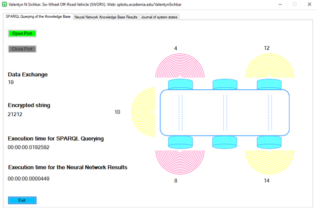
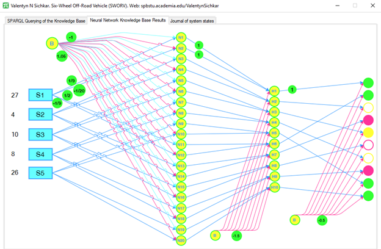
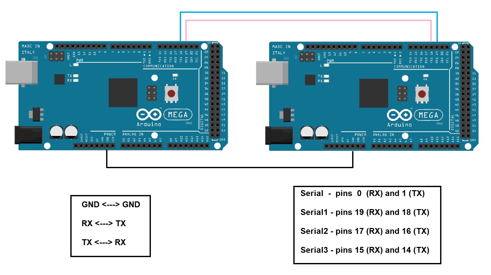

# Intelligent Mobile Robot
Intelligent Navigation System of Mobile Robot.
 

### Reference to:
Valentyn N Sichkar. Intelligent Navigation System of Mobile Robot // GitHub platform. DOI: 10.5281/zenodo.1317907

## Description
 <b>Hardware</b> - Arduino Mega, Motor Shield L298P, DC Motors, Ultrasonic Sensors, Gyroscope, Laser Sensors, Cameras, Lidar Sensor, Bluetooth Module, Batteries, Six Wheel High Pass Base with Active Suspension.
 <b>Software</b> - C# via Visual Studio, Python, Arduino IDE, Android SDK, Matlab.
 <b>Developmet</b> - Algorithms for Overcoming Obstacles, Algorithms for Localization, Algorithms for Mapping, SLAM Algorithms.

The investigation of Reinforcement Learning for the tasks of shortest path planning is put in separate repository and is available here: https://github.com/sichkar-valentyn/Reinforcement_Learning_in_Python

The research results for Neural Network Knowledge Based system for the tasks of collision avoidance is put in separate repository and is available here: https://github.com/sichkar-valentyn/Matlab_implementation_of_Neural_Networks

The study of Semantic Representation of knowledge and querying of it through owl files with SPARQL is put in separate repository and is available here: https://github.com/sichkar-valentyn/System_programming_for_SPARQL_querying_with_interface_development_by_html_files

## Content
* <a href="#Introduction">Introduction</a>
* <a href="#Connecting DC Motors">Connecting DC Motors</a>
* <a href="#More information about equipment">More information about equipment</a>
* <a href="#Adding FIVE Ultrasonic sensors US-015">Adding FIVE Ultrasonic sensors US-015</a>
* <a href="#Checking the abilities to stop before the possible collisions with obstacles">Checking the abilities to stop before the possible collisions with obstacles</a>
* <a href="#Adding TEN Ultrasonic sensors HC-SR04">Adding TEN Ultrasonic sensors HC-SR04</a>
* <a href="#Connecting two Arduino Mega together">Connecting two Arduino Mega together</a>
* <a href="#Checking the abilities to overcome obstacles">Checking the abilities to overcome obstacles</a>
* <a href="#Adding Gyroscope">Adding Gyroscope</a>
* <a href="#Adding Lidar Sensor">Adding Lidar Sensor</a>
* <a href="#Adding Camera">Adding Camera</a>

### <a name="Introduction">Introduction</a>
Explaining the main goals of the Project
 https://www.youtube.com/watch?v=srEd8KEh2uo
 

### <a name="Connecting DC Motors">Connecting DC Motors</a>
Connecting and checking the High Pass Six Wheel Base - HPSWB - for simple commands to move
 https://www.youtube.com/watch?v=Ux8xrQHnlzI
 

### <a name="More information about equipment">More information about equipment</a>
General view of the Motor Shield L298P is shown below on the figure

 The view from the top of Motor Shield L298P and showing the main connectors that are needed for the Project.
 

 General view of the DC Motor
 

 Connection DC Motors to the Shield
 

 General view of the Bluetooth Module HC-06
 

 Connection Bluetooth Module HC-06 to the Shield or Arduino
 

 More about equipment
 https://www.youtube.com/watch?v=6KQcZUehVFo
 

 General view of the Ultrasonic Sensor US-015
 

 Connection Ultrasonic Sensor US-015 (or HC-SR04) to the Arduino
 

 Equations for Ultrasonic Sensors, explaining how they work
 

### <a name="Adding FIVE Ultrasonic sensors US-015">Adding FIVE Ultrasonic sensors US-015</a>
Checking the environment around with Ultrasonic Sensors US-015
 HPSWB with Ultrasonic Sensors - view from the front

 HPSWB with Ultrasonic Sensors - view from the back

 HPSWB with Ultrasonic Sensors - view from one side

### Figure below shows the results of working system in Real Time by SPARQL Querying of the Knowledge Base

### This figure shows the results of Neural Network Knowledge Base

### <a name="Checking the abilities to stop before the possible collisions with obstacles">Checking the abilities to stop before the possible collisions with obstacles</a>
With the help of Ultrasonic Sensors and seeing the obstacles to avoid the collisions
 https://www.youtube.com/watch?v=QVCCuo-QOwA
 

### <a name="Adding TEN Ultrasonic sensors HC-SR04">Adding TEN Ultrasonic sensors HC-SR04</a>
Checking the environment around with Ten Ultrasonic Sensors HC-SR04
 HPSWB - view from the front

### <a name="Connecting two Arduino Mega together">Connecting two Arduino Mega together</a>
The way how to connect Master and Slave Arduino Mega together through Serial Port
 

### <a name="Checking the abilities to overcome obstacles">Checking the abilities to overcome obstacles</a>
Implementing and testing Algorithms for HPSWB
 https://www.youtube.com/watch?v=rjMo-d7WrMY
 

### <a name="Adding Gyroscope">Adding Gyroscope</a>
Adding Gyroscope in order to rotate HPSWB precisely to a needed degree regardless of battery charge
 _Coming soon_

### <a name="Adding Lidar Sensor">Adding Lidar Sensor</a>
Checking the environment with Lidar Sensor
 _Coming soon_

### <a name="Adding Camera">Adding Camera</a>
Working with Computer Vision
 _Coming soon_

 

### MIT License
### Copyright (c) 2017-2018 Valentyn N Sichkar
### github.com/sichkar-valentyn
### Reference to:
Valentyn N Sichkar. Intelligent Navigation System of Mobile Robot // GitHub platform. DOI: 10.5281/zenodo.1317907
